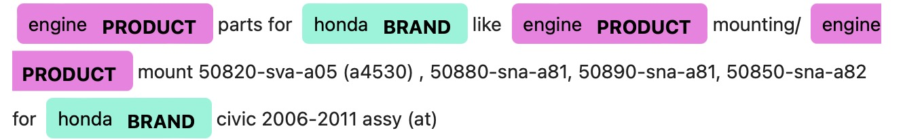
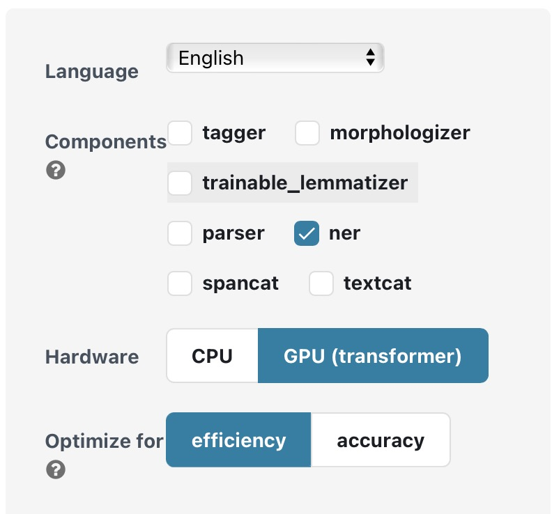

# Custom NER
* * * *
Use our code can easy to train a custom new model to infer.



This project is implemented based on [spacy](https://github.com/explosion/spaCy). So I'm just a porter.

First you can use the test.py to ner some car brands, types and component.

For the model, we use a small amount of manual annotation.

We simply extracted a part of car brands, types and component from the wiki, manually labeled them with a small amount, and then matched them from the text to automatically create a NER dataset. This eliminates the need to use such NER annotation tools.

General annotation tools likes, 

[Doccano](https://doccano.herokuapp.com)

[Tagtog](https://www.tagtog.net)

[LightTag](https://www.lighttag.io)

[Prodigy](https://demo.prodi.gy/?=null&view_id=ner_manual)
* * * *
##Data processing

 If you have both sentences and entity words, you might as well use the **get_ner_dataset.py** to directly generate the files needed for training through matching.

You can modify your file location and other parameters in the **ner_data_config()** function in the file, and there are corresponding annotations. This is a code that supports multi-processing. If you don't have much data, you can run the following code for single-process operation.

Also you can use this code to set the parameters, but note that there must be no spaces before and after "="
```
python get_ner_dataset.py with entity_path="./dataset/entity" \                                         
class_path="./dataset/class.txt" text_type='pkl' \  
text_path="/Users/xcxhy/AIProject/dataset/ner/prodid_to_prodname_dict.pkl" \ 
save_dir="./dataset" 
```
The single-process code is running, please run the concat file
```                                    
python concat_dict.py
```
 **Attention:** This requires you to use the category you want to identify to name the file, for example, we use "brand.txt" to name the brand entity. For documents containing entity words, I have set two formats: 'pkl' or 'txt'. We recommend saving documents in txt format, and saving each sentence with a newline.

Multi-process runs the main.sh file directly, and the parameters that need to be modified should be modified in the file.

Liunx：
```
./data.sh
```
MacOS
```
source data.sh
```
* * * *
##Build NER dataset
Using the above data processing method, a **new_real_ner_dict.pkl** file will be obtained. It is stored in the form of a dictionary. The outermost key is "annotations", which are embedded with two dictionaries with "text" and "entities" as keys. "text" stores the sentence text, and "entities" stores a list consisting of multiple (start, end, label) triples.

If you use other methods to preprocess the data, in order to ensure the normal operation of the training, please save the dictionary in this structure. The file type can be saved as "pkl" or "json". Please input the file path and type into the terminal before running the code.（default type="pkl", path="./dataset/new_real_ner_dict.pkl"）

```
python spacy_dataset.py with path=<your file path> type=<your type>
```
* * * *
##Train Model
Before training, you must first add a configuration file to [sapcy config](https://spacy.io/usage/training#quickstart) and choose the task you need to train.

You can choose not to set, use our default settings, only do **ner** tasks, and choose gpu acceleration at the same time.If you need more settings please refer to the documentation.

**Attention**: If you use your own settings, make sure the **base_config.cfg** file is in the **custom_ner** folder.

We have two files for training the model, one is train.py and split_train.py, if the amount of data is not much, you can run train.py directly.(Make sure to run **spacy_dataset.py** before running the **train.py** file)
```
python train.py
```
The **split_train.py** file is mainly to solve the memory problem caused by too much training text.

```
python split_train.py
```
During the training process, you can use GPU acceleration, set the **gpu-id** parameter to **0** or specify the graphics card in the training code.

* * * *
## Test
Simple test using **ner_infer.py** file
```
python ner_infer.py
```
